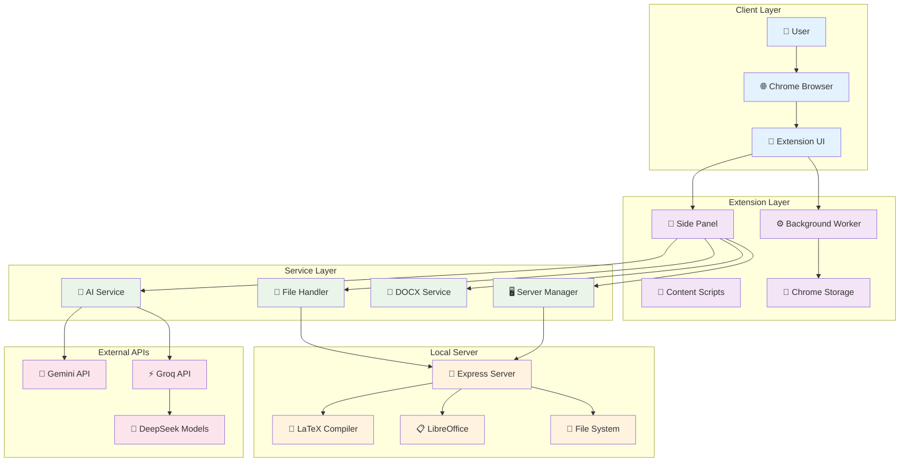
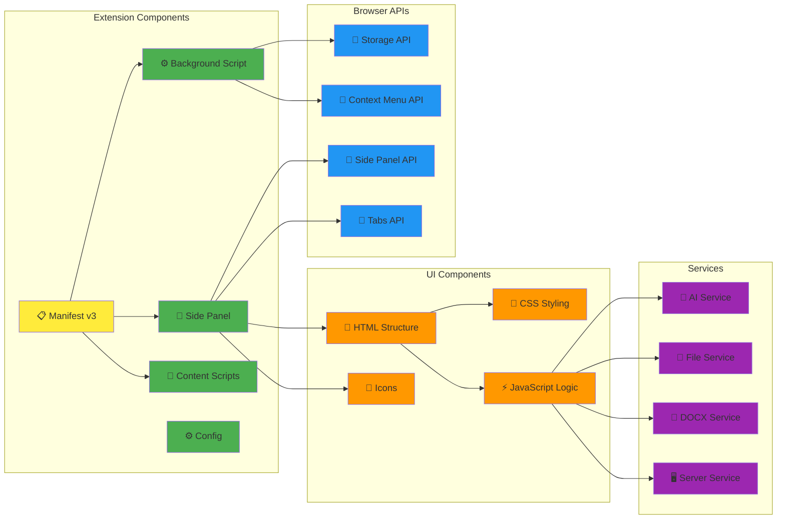
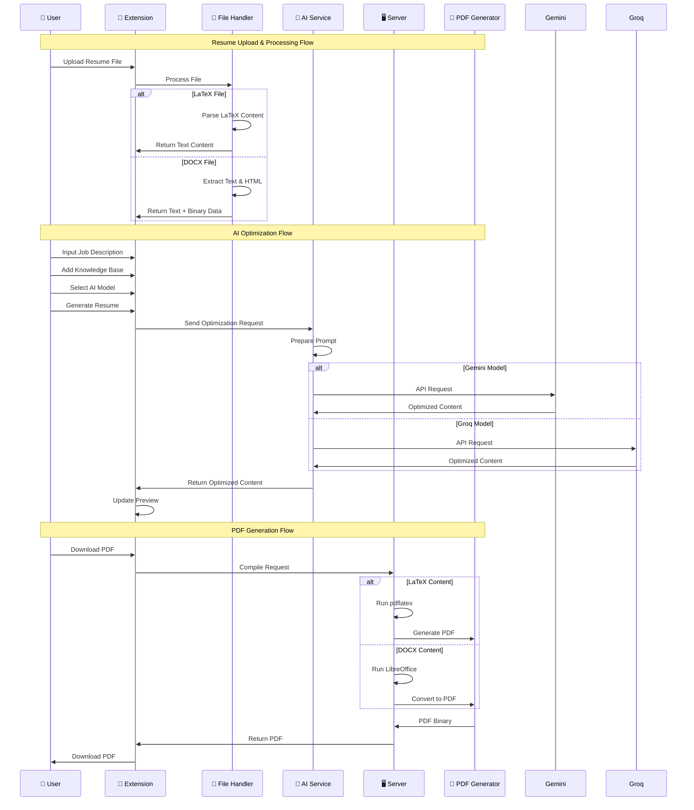
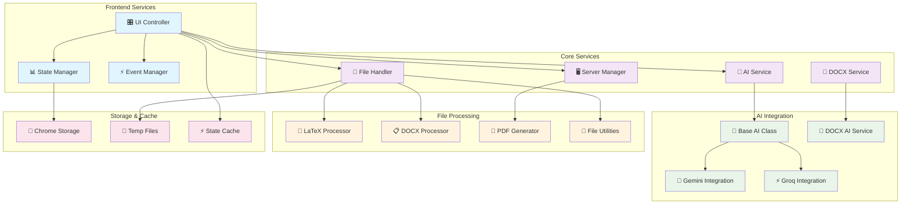
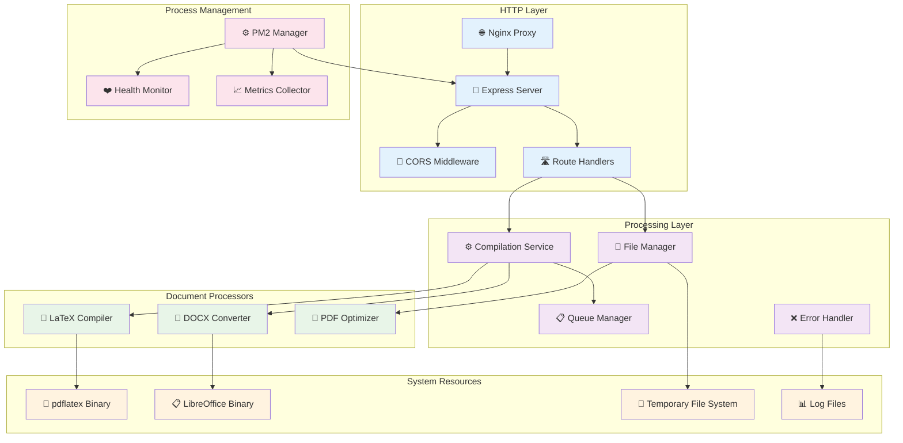
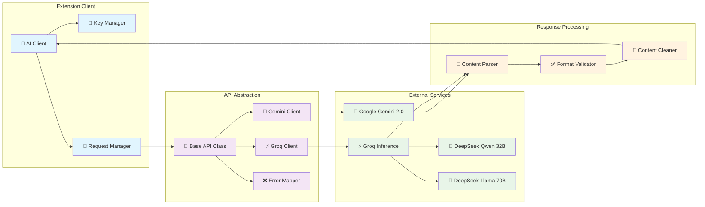
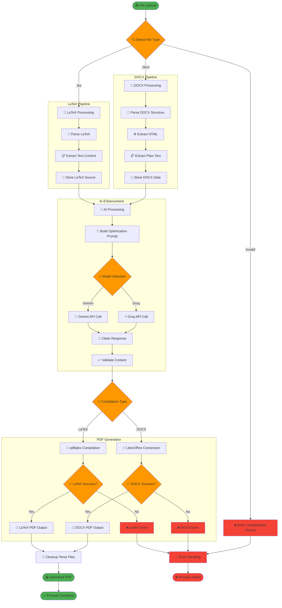
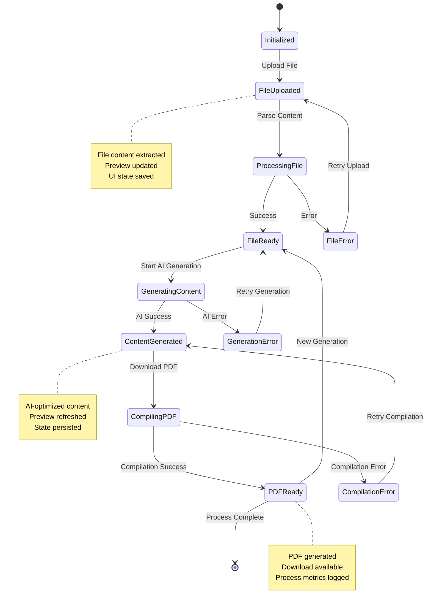
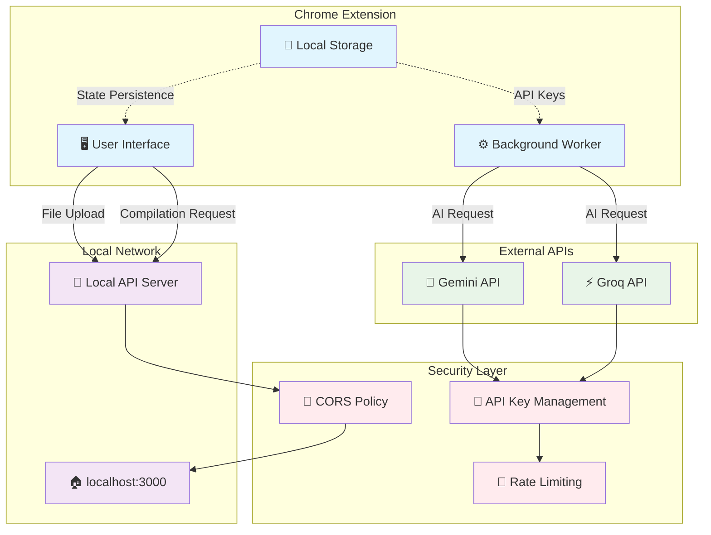

# Architecture Diagrams

This document contains detailed architecture diagrams and technical specifications for the Agentex Resume Editor system.

## 🏗️ System Architecture Overview

## 📱 Chrome Extension Architecture

## 🔄 Data Flow Architecture

## 🛠️ Service Layer Architecture

## 🖥️ Server Architecture

## 🔌 API Integration Architecture

## 📄 Document Processing Pipeline

## 🔄 State Management Architecture

## 🌐 Network Communication Architecture

## 📊 Performance Architecture

```mermaid
graph TB
    subgraph "Performance Monitoring"
        METRICS[📊 Metrics Collection]
        PERF_MONITOR[📈 Performance Monitor]
        ALERTING[🚨 Alerting System]
    end
    
    subgraph "Optimization Layers"
        REQUEST_CACHE[⚡ Request Cache]
        FILE_CACHE[📁 File Cache]
        RESPONSE_COMPRESS[🗜️ Response Compression]
        LAZY_LOADING[💤 Lazy Loading]
    end
    
    subgraph "Resource Management"
        MEMORY_MGR[🧠 Memory Manager]
        CPU_MONITOR[⚙️ CPU Monitor]
        DISK_CLEANUP[🧹 Disk Cleanup]
        PROCESS_QUEUE[📋 Process Queue]
    end
    
    subgraph "Scalability"
        LOAD_BALANCER[⚖️ Load Balancer]
        HORIZONTAL_SCALE[↔️ Horizontal Scaling]
        VERTICAL_SCALE[↕️ Vertical Scaling]
        CDN[🌐 CDN Distribution]
    end
    
    METRICS --> PERF_MONITOR
    PERF_MONITOR --> ALERTING
    
    REQUEST_CACHE --> RESPONSE_COMPRESS
    FILE_CACHE --> LAZY_LOADING
    
    MEMORY_MGR --> CPU_MONITOR
    CPU_MONITOR --> DISK_CLEANUP
    DISK_CLEANUP --> PROCESS_QUEUE
    
    LOAD_BALANCER --> HORIZONTAL_SCALE
    HORIZONTAL_SCALE --> VERTICAL_SCALE
    VERTICAL_SCALE --> CDN
    
    classDef monitoring fill:#e1f5fe
    classDef optimization fill:#f3e5f5
    classDef resource fill:#e8f5e8
    classDef scaling fill:#fff3e0
    
    class METRICS,PERF_MONITOR,ALERTING monitoring
    class REQUEST_CACHE,FILE_CACHE,RESPONSE_COMPRESS,LAZY_LOADING optimization
    class MEMORY_MGR,CPU_MONITOR,DISK_CLEANUP,PROCESS_QUEUE resource
    class LOAD_BALANCER,HORIZONTAL_SCALE,VERTICAL_SCALE,CDN scaling
```

---

These diagrams provide comprehensive visual documentation of the Agentex Resume Editor architecture, covering all major components, data flows, and system interactions.