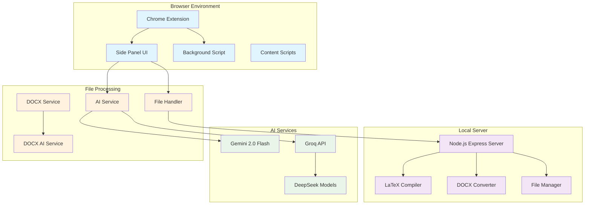
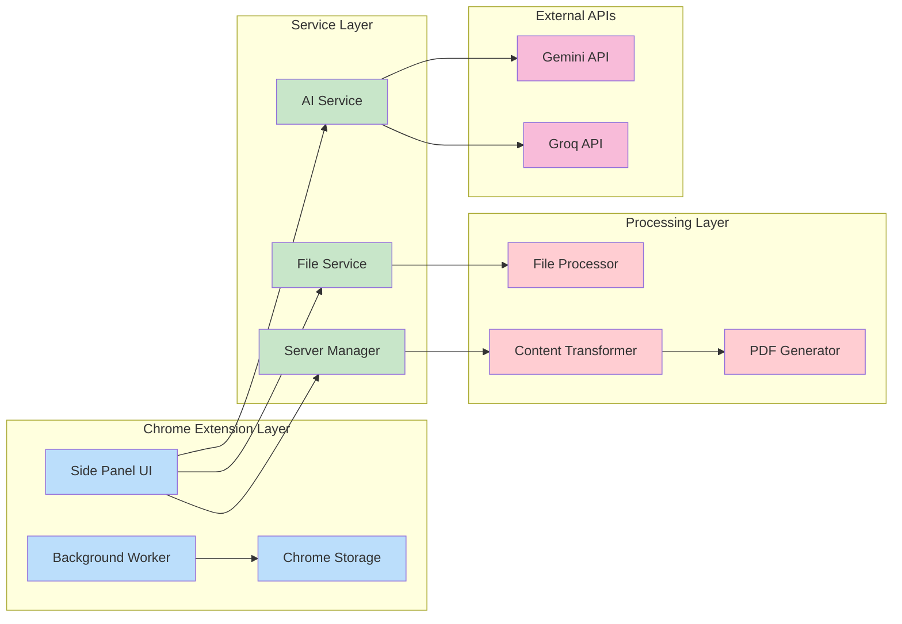
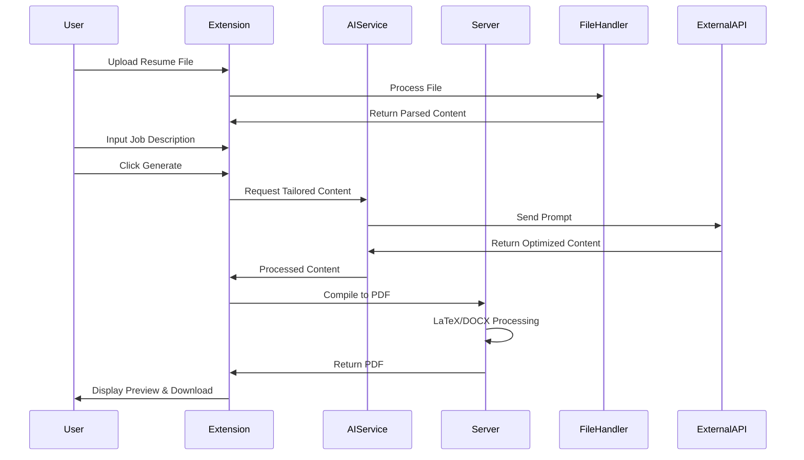

# Agentex Resume Editor

An AI-powered Chrome extension that intelligently tailors your resume to specific job descriptions and generates professional PDF outputs. Agentex leverages advanced AI models to optimize your resume content while maintaining formatting and structure.

## 🚀 Features

- **AI-Powered Resume Tailoring**: Automatically optimize resume content based on job descriptions
- **Multiple File Format Support**: Works with both LaTeX (.tex) and DOCX (.docx) resume files
- **Multi-Model AI Integration**: Supports Gemini 2.0 Flash and Groq (DeepSeek) models
- **Real-time Preview**: Live preview of both raw content and compiled PDF
- **Knowledge Base Integration**: Add personal achievements and experiences to enhance tailoring
- **Local PDF Compilation**: Secure local server for LaTeX and DOCX to PDF conversion
- **Chrome Extension Integration**: Seamless browser integration with side panel UI

## 📐 Architecture Overview



## 🏗️ System Architecture

### Component Architecture



### Data Flow Diagram



## 🛠️ Technology Stack

### Frontend Technologies
- **Chrome Extension API**: Manifest V3 with side panel integration
- **HTML5/CSS3**: Modern responsive UI with glass morphism design
- **Vanilla JavaScript**: ES6+ for extension logic and DOM manipulation
- **Material Icons**: Google Material Design icons for UI elements

### Backend Technologies
- **Node.js**: Runtime environment for server operations
- **Express.js**: Web framework for API endpoints
- **PM2**: Process manager for production deployment

### File Processing
- **LaTeX/pdflatex**: Professional PDF generation from LaTeX
- **LibreOffice Convert**: DOCX to PDF conversion
- **Mammoth.js**: DOCX to HTML conversion
- **docxtemplater**: DOCX template processing
- **PizZip**: ZIP file manipulation for DOCX files

### AI Integration
- **Google Gemini 2.0 Flash**: Advanced text generation and optimization
- **Groq API**: High-performance inference for DeepSeek models
- **DeepSeek Models**: 
  - DeepSeek-R1-Distill-Qwen-32B
  - DeepSeek-R1-Distill-Llama-70B

### Storage & Persistence
- **Chrome Storage API**: Local extension data storage
- **File System**: Temporary file handling for compilation
- **UUID**: Unique identifier generation for file management

### Development Tools
- **Nodemon**: Development server auto-restart
- **Multer**: File upload middleware
- **CORS**: Cross-origin resource sharing configuration

## 📦 Installation

### Prerequisites
- **Node.js** (v18 or higher)
- **npm** (v9 or higher)
- **TeX Live** (for LaTeX compilation)
- **LibreOffice** (for DOCX conversion)
- **Chrome Browser** (for extension)

### Server Setup

1. **Clone the repository**:
   ```bash
   git clone https://github.com/sbeeredd04/Agentex.git
   cd Agentex/tailored-resume-extension/server
   ```

2. **Install dependencies**:
   ```bash
   npm install
   ```

3. **Install system dependencies** (Ubuntu/Debian):
   ```bash
   chmod +x setup.sh
   ./setup.sh
   ```

   **Manual installation**:
   ```bash
   # Install TeX Live
   sudo apt-get install texlive texlive-latex-extra texlive-fonts-recommended
   
   # Install PM2
   sudo npm install -g pm2
   
   # Create directories
   sudo mkdir -p /tmp/pdf
   sudo chmod 777 /tmp/pdf
   ```

4. **Start the server**:
   ```bash
   npm start
   # or with PM2
   pm2 start ecosystem.config.js
   ```

### Chrome Extension Installation

1. **Open Chrome** and navigate to `chrome://extensions/`

2. **Enable Developer Mode** (toggle in top right)

3. **Load Extension**:
   - Click "Load unpacked"
   - Select the `tailored-resume-extension` folder

4. **Configure API Keys**:
   - Click the extension icon or use `Ctrl+Shift+Y`
   - Open Settings and add your API keys:
     - Gemini API Key
     - Groq API Key (optional)

## 🎯 Usage Guide

### Basic Workflow

1. **Open Agentex**: Click the extension icon or use `Ctrl+Shift+Y` (Cmd+Shift+Y on Mac)

2. **Upload Resume**: 
   - Click "Upload Resume" 
   - Select your `.tex` or `.docx` file
   - View the parsed content in the preview

3. **Add Job Description**:
   - Paste the target job description in the designated field
   - Include specific requirements and keywords

4. **Enhance with Knowledge Base** (Optional):
   - Add personal achievements, skills, and experiences
   - This helps the AI generate more relevant content

5. **Select AI Model**:
   - Choose between Gemini 2.0 Flash or Groq models
   - Different models may provide varying optimization styles

6. **Generate Tailored Resume**:
   - Click "Generate Resume"
   - Review the AI-optimized content
   - Switch between raw and compiled preview

7. **Download PDF**:
   - Click "Download PDF" to get the final document
   - The PDF maintains professional formatting

### Advanced Features

#### Model Selection
- **Gemini 2.0 Flash**: Best for comprehensive content optimization
- **DeepSeek Qwen 32B**: Fast inference with good quality
- **DeepSeek Llama 70B**: High-quality optimization for complex requirements

#### File Format Support
- **LaTeX (.tex)**: Professional academic and technical resumes
- **DOCX (.docx)**: Standard business resume format

#### Preview Modes
- **Raw View**: See the optimized text content
- **Compiled View**: Live PDF preview with formatting

## 🔧 API Documentation

### Server Endpoints

#### POST `/compile`
Compile LaTeX content to PDF

**Request Body**:
```json
{
  "latex": "\\documentclass{article}\\begin{document}...\\end{document}"
}
```

**Response**: PDF binary data

#### POST `/compile-docx`
Convert DOCX to PDF

**Request**: Multipart form data with DOCX file

**Response**: PDF binary data

#### POST `/save-docx`
Save generated DOCX content

**Request**: Multipart form data with content and metadata

**Response**:
```json
{
  "success": true,
  "message": "DOCX saved successfully"
}
```

### Chrome Extension APIs

#### Storage API Usage
```javascript
// Save state
await chrome.storage.local.set({ sidebarState: state });

// Retrieve state
const { sidebarState } = await chrome.storage.local.get('sidebarState');
```

#### Side Panel API
```javascript
// Open side panel
await chrome.sidePanel.open({ windowId: tab.windowId });
```

## 🚀 Development

### Project Structure
```
tailored-resume-extension/
├── manifest.json              # Extension manifest
├── background.js             # Service worker
├── sidepanel.html           # Main UI
├── sidepanel.js             # UI logic
├── style.css                # Styling
├── config.js                # Configuration
├── icons/                   # Extension icons
├── lib/vendor/              # Third-party libraries
├── services/                # Core services
│   ├── ai-service.js        # AI integration
│   ├── docx-ai-service.js   # DOCX-specific AI
│   ├── docx-service.js      # DOCX processing
│   └── file-handler.js      # File operations
├── server/                  # Local server
│   ├── server.js            # Main server
│   ├── serverManager.js     # Server management
│   ├── package.json         # Dependencies
│   └── setup.sh             # Setup script
└── backend/                 # Alternative backend
    └── compile-server.js    # Compilation server
```

### Development Setup

1. **Install dependencies**:
   ```bash
   cd tailored-resume-extension/server
   npm install
   ```

2. **Start development server**:
   ```bash
   npm run dev
   ```

3. **Load extension in Chrome**:
   - Enable Developer Mode in `chrome://extensions/`
   - Load unpacked extension

4. **Monitor logs**:
   - Extension: Chrome DevTools Console
   - Server: Terminal output or PM2 logs

### Building for Production

1. **Server deployment**:
   ```bash
   pm2 start ecosystem.config.js
   pm2 save
   pm2 startup
   ```

2. **Extension packaging**:
   ```bash
   # Create ZIP for Chrome Web Store
   zip -r agentex-extension.zip tailored-resume-extension/ -x "*/node_modules/*" "*/.*"
   ```

### Code Style and Conventions

- **JavaScript**: ES6+ with modern async/await patterns
- **Error Handling**: Comprehensive try-catch blocks with logging
- **Logging**: Structured logging with component prefixes
- **API Design**: RESTful endpoints with proper HTTP status codes

## 🔒 Security Considerations

- **API Keys**: Stored locally in Chrome storage (not in code)
- **File Processing**: Temporary files with UUID naming
- **CORS**: Restricted to specific origins
- **Local Server**: Runs on localhost only
- **Data Privacy**: No data sent to external servers except AI APIs

## 🐛 Troubleshooting

### Common Issues

#### Server Won't Start
```bash
# Check if port 3000 is in use
lsof -i :3000

# Kill existing process
kill -9 <PID>

# Restart server
npm start
```

#### LaTeX Compilation Errors
```bash
# Check pdflatex installation
which pdflatex

# Install missing packages
sudo apt-get install texlive-latex-extra
```

#### Extension Not Loading
1. Check manifest.json syntax
2. Verify all required permissions
3. Check Chrome DevTools for errors
4. Reload extension in chrome://extensions/

#### PDF Generation Fails
1. Verify LaTeX syntax in content
2. Check server logs for compilation errors
3. Ensure all dependencies are installed
4. Check file permissions for /tmp/pdf

### Debug Mode

Enable debug logging:
```javascript
// In extension
localStorage.setItem('debug', 'true');

// In server
DEBUG=* npm start
```

## 🤝 Contributing

1. **Fork the repository**
2. **Create a feature branch**: `git checkout -b feature/new-feature`
3. **Make changes** and test thoroughly
4. **Add documentation** for new features
5. **Submit a pull request** with detailed description

### Code Review Checklist

- [ ] Code follows existing style conventions
- [ ] All functions have proper error handling
- [ ] New features include appropriate logging
- [ ] Documentation is updated
- [ ] Security considerations are addressed

## 📄 License

This project is licensed under the MIT License. See the [LICENSE](LICENSE) file for details.

## 🙏 Acknowledgments

- **Google Gemini**: Advanced AI text generation
- **Groq**: High-performance AI inference
- **DeepSeek**: Open-source AI models
- **LaTeX Community**: Professional document typesetting
- **Chrome Extensions**: Browser integration platform

---

**Agentex Resume Editor** - Transforming resume tailoring with AI-powered intelligence.